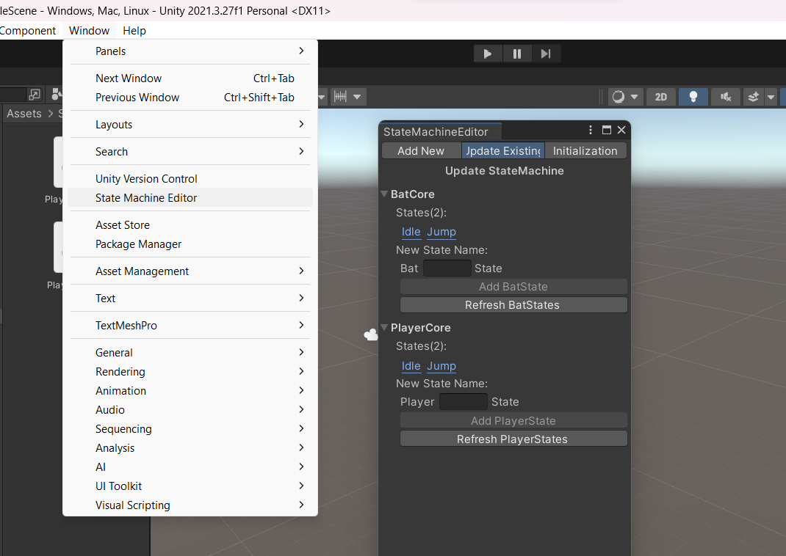
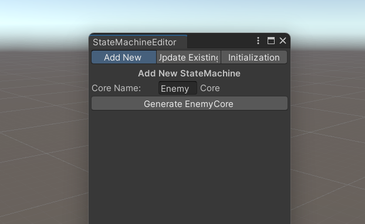
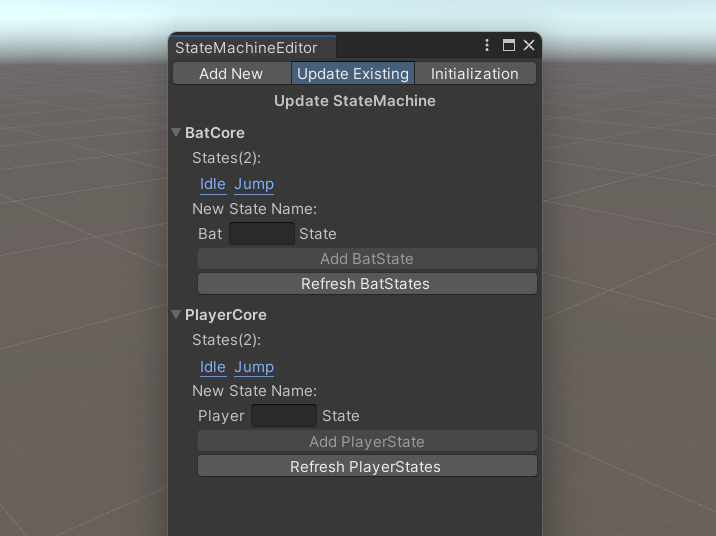

<h1 align="center">Unity Reusable Finite State Machine with Editor</h1>

Unity Reusable Finite State Machine with Editor is an implementation of Finite State Machine design pattern in Object Oriented Programming. What's special about this is that the base class for the state machine is reusable, meaning we don't have to rewrite the base class that contains enter, update, and exit everytime we want to create another state machine. In this tool, simply just need to inherit the `Core<T,U>` class where T is the current class and U is the class that list or cache the states. For example `public class PlayerCore : Core<PlayerCore, PlayerStates>`. There's also an editor that can be used to create the states inclucing the listing or caching the states part. This is designed for programmer which is why the editor is only used to view what are the states and to automatically create new state.


## ✨ Features

- Reusable base class for state machine
- Can add custom function that can be overriden on any state, for example the OnHurt one.
- An editor to view what are the states and to create a new state including automatically caching it in the states (the U of Core<T,U>)
- Bonus feature for a good implementation for HitRequest and HitResult


## ⚙️ How To Use
- Simply open the Window/State Machine Editor

- You can Add new or Update Existing state


- You can also change the location of the state machine folder in the Initialization menu. But this can also be done automatically without any configuration.
- Click `Add <state name>State` button to generate a new state including caching the states.
- Click `Refresh <state name>States` button after deleting a state.


## 🔍 API Reference

### 🔗 Syntax

| Method                                  | Description                        |
|:--------                                | :------------------------------    |
|`SwitchState(BaseState<T, U> newState)`  |Change the current states to newState. |
|`StateEnter()`                           |Called when entering a new state. It happens inside SwitchState. |
|`StateUpdate()`                          |Called every update frame after StateEnter|
|`StateFixedUpdate()`                     |Called every update frame after StateEnter|   
|`StateExit()`                            |Called when exiting a state. It happens inside SwitchState|   
|`OnHurt(HitRequest hitParams, ref HitResult hitResult)`  |Override in any state to change the behavior when getting hit|

| Properties                  |Type                | Description                        |
|:--------                    |:-----------        | :------------------------------    |
|`Core`                       |T                   | For example the PlayerCore. |


#### 📖 Examples

The PlayerCore class, containing states in PlayerStates. 
```csharp
public class PlayerCore : Core<PlayerCore, PlayerStates>
{
    float _health;
    void Start()
    {
        States = new PlayerStates(this);
        CurrentState = States.Idle();
        CurrentState.StateEnter();
    }
    void Update()
    {
        CurrentState.StateUpdate();
    }
    void FixedUpdate()
    {
        CurrentState.StateFixedUpdate();
    }

    public void HitEnemy()
    {
        HitResult hitResult = new HitResult();
        GetComponent<Core>().OnHurt(new HitRequest(
            damage: 10, 
            knockback: 100, 
            direction: Vector2.up, 
            element: Element.Fire, 
            stunDuration: 0.5f
        ), ref hitResult);
        if(hitResult.Type == HitType.Entity)
        {
            Debug.Log("Hit Entity");
        }
    }
}
```

Content of PlayerAttackState. Basically, press H to attack. It access the PlayerCore with Core.
```csharp
public class PlayerAttackState : BaseState<PlayerCore, PlayerStates>
{
    public PlayerAttackState(PlayerCore contextCore, PlayerStates States) : base (contextCore, States)
    {
    }

    public override void StateEnter()
    {
        
    }

    public override void StateUpdate()
    {
        if(Input.GetKeyDown(KeyCode.H))
        {
            Core.HitEnemy();
        }
    }
    public override void StateFixedUpdate()
    {

    }

    public override void StateExit()
    {
        
    }
    public override void OnHurt(HitRequest hitRequest, ref HitResult hitResult)
    {
        Debug.Log("Got hit with damage: " + hitRequest.Damage.ToString());
    }
}

```


The content of PlayerStates. This is the part that can be auto generated with the editor.
```csharp
public class PlayerStates : States<PlayerCore, PlayerStates>
{
    Dictionary<State, BaseState<PlayerCore, PlayerStates>> _states = new Dictionary<State, BaseState<PlayerCore, PlayerStates>>();
    
    enum State
    {
        Attack, Idle, Jump, Run, 
    }
    public PlayerStates(PlayerCore contextCore) : base (contextCore)
    {
        _states[State.Attack] = new PlayerAttackState(Core, this);
        _states[State.Idle] = new PlayerIdleState(Core, this);
        _states[State.Jump] = new PlayerJumpState(Core, this);
        _states[State.Run] = new PlayerRunState(Core, this);

    }

    public BaseState<PlayerCore, PlayerStates> Attack() => _states[State.Attack];
    public BaseState<PlayerCore, PlayerStates> Idle() => _states[State.Idle];
    public BaseState<PlayerCore, PlayerStates> Jump() => _states[State.Jump];
    public BaseState<PlayerCore, PlayerStates> Run() => _states[State.Run];
}
```

## 📝 License
[MIT](https://choosealicense.com/licenses/mit/)
